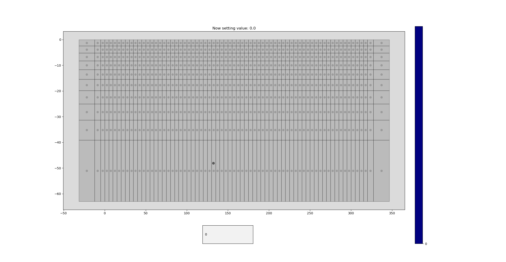
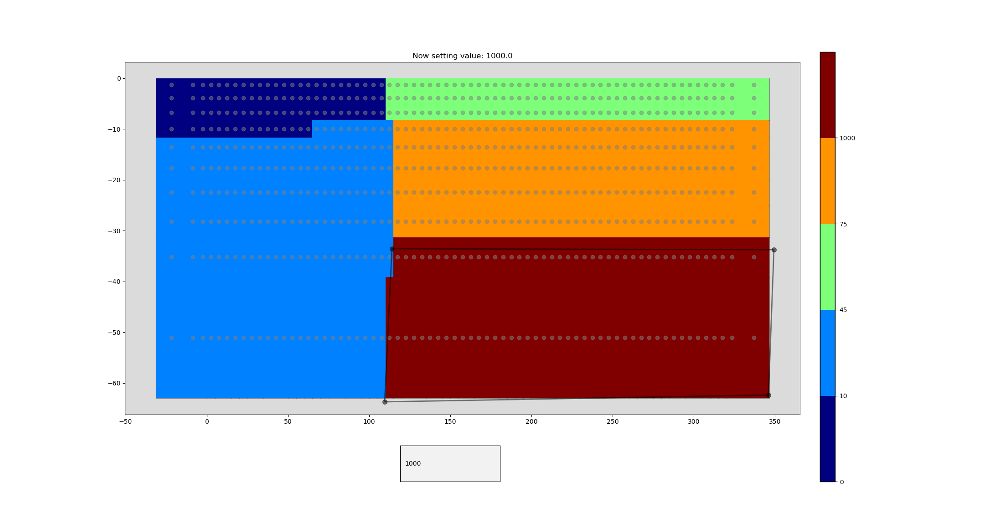

# Mohinh package
```
pip install mohinh
```

Python toolbox in construction to assign values to a computational grid.
Select points in the figure by enclosing them within a polygon.
The ending point as to be the starting point as to enclose the shape.

Press the **esc** key to start a new polygon.
Hold the **shift** key to move all of the vertices.
Hold the **ctrl** key to move a single vertex.




